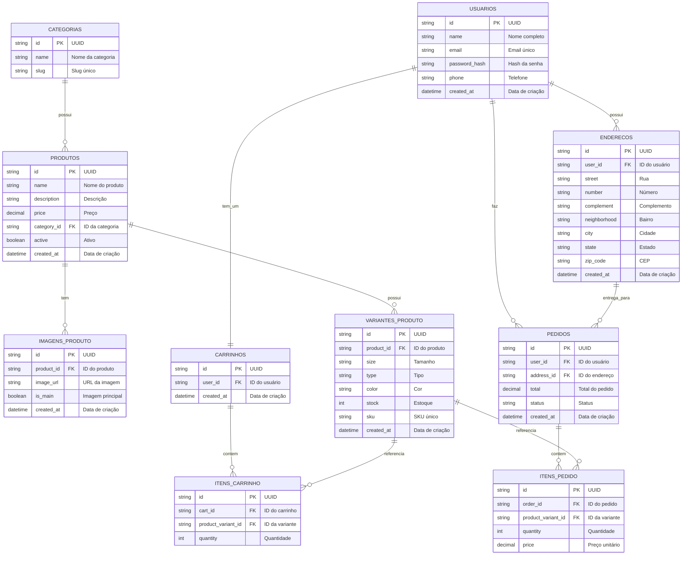

# Esquema do Banco de Dados - DN Store

Este documento apresenta o modelo visual do esquema do banco de dados da aplicação DN Store, uma loja virtual desenvolvida com Spring Boot e MySQL.

## Diagrama ER (Entidade-Relacionamento)

## Descrição das Entidades

### CATEGORIAS
- **id**: Identificador único (UUID)
- **name**: Nome da categoria
- **slug**: Identificador amigável único para URLs

### PRODUTOS
- **id**: Identificador único (UUID)
- **name**: Nome do produto
- **description**: Descrição detalhada
- **price**: Preço do produto
- **category_id**: Referência à categoria
- **active**: Status de ativação do produto
- **created_at**: Data de criação

### IMAGENS_PRODUTO
- **id**: Identificador único (UUID)
- **product_id**: Referência ao produto
- **image_url**: URL da imagem
- **is_main**: Indica se é a imagem principal
- **created_at**: Data de criação

### VARIANTES_PRODUTO
- **id**: Identificador único (UUID)
- **product_id**: Referência ao produto
- **size**: Tamanho da variante
- **type**: Tipo da variante
- **color**: Cor da variante
- **stock**: Quantidade em estoque
- **sku**: Código SKU único
- **created_at**: Data de criação

### USUARIOS
- **id**: Identificador único (UUID)
- **name**: Nome completo do usuário
- **email**: Email único
- **password_hash**: Hash da senha
- **phone**: Número de telefone
- **created_at**: Data de criação

### ENDERECOS
- **id**: Identificador único (UUID)
- **user_id**: Referência ao usuário
- **street**: Rua
- **number**: Número
- **complement**: Complemento
- **neighborhood**: Bairro
- **city**: Cidade
- **state**: Estado
- **zip_code**: CEP
- **created_at**: Data de criação

### CARRINHOS
- **id**: Identificador único (UUID)
- **user_id**: Referência ao usuário
- **created_at**: Data de criação

### ITENS_CARRINHO
- **id**: Identificador único (UUID)
- **cart_id**: Referência ao carrinho
- **product_variant_id**: Referência à variante do produto
- **quantity**: Quantidade do item

### PEDIDOS
- **id**: Identificador único (UUID)
- **user_id**: Referência ao usuário
- **address_id**: Referência ao endereço de entrega
- **total**: Valor total do pedido
- **status**: Status do pedido (pending, processing, shipped, delivered)
- **created_at**: Data de criação

### ITENS_PEDIDO
- **id**: Identificador único (UUID)
- **order_id**: Referência ao pedido
- **product_variant_id**: Referência à variante do produto
- **quantity**: Quantidade do item
- **price**: Preço unitário no momento da compra

## Relacionamentos

- Uma **CATEGORIA** pode ter vários **PRODUTOS**
- Um **PRODUTO** pode ter várias **IMAGENS_PRODUTO**
- Um **PRODUTO** pode ter várias **VARIANTES_PRODUTO**
- Um **USUARIO** pode ter vários **ENDERECOS**
- Um **USUARIO** tem exatamente um **CARRINHO**
- Um **CARRINHO** pode conter vários **ITENS_CARRINHO**
- Um **USUARIO** pode fazer vários **PEDIDOS**
- Um **ENDERECO** pode ser usado em vários **PEDIDOS**
- Um **PEDIDO** pode conter vários **ITENS_PEDIDO**

Este esquema suporta um sistema de e-commerce completo com autenticação de usuários, gerenciamento de produtos com variantes, carrinho de compras e processamento de pedidos.